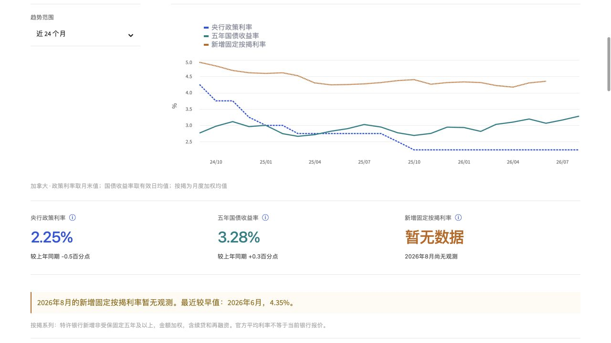

# 页面外观样本与后续设计要求

文档日期：2026-09-24。仅为当前页面的有限范围抽看与规划，不是全站审计、改版完成或可访问性验收。用户已澄清：重点是看板自身的分隔线、边框与控件下划线，而不是图表数据曲线。后续如需改样式，先在现有 Figma 中修改与复核，再落实代码。

## 1. 经济与供给 → 利率区与指标区

状态：图表、三项指标和缺期说明可见；指标区上下边框、下方提示和主题边界在同一屏内反复分隔，可优先比较减少装饰线后的层级。下图为本次留存的 1280×720 桌面视口，展示对应区段，不是整个页面。

优点：指标归属和按揭缺期说明清楚，提示并非只靠颜色。候选改进：在 Figma 中以留白组织指标与提示，试去指标区冗余的上下边框，并检查是否仍需要主题分隔。图中的实际利率曲线不是此次删减目标。

可访问性边界：去掉边框不能同时去掉键盘焦点、可点击控件边界或警告文字；本次未测试完整键盘路径、对比度标准或 320／390px，不能称已通过。

## 静态代码核对与待扩展审阅

`src/housing/dashboard.css` 中可见 `.metric-grid` 上下边框、`stExpander` 顶线、选择／输入控件下划线、`.section-jump` 与经济主题分隔、表格行线等规则。代码说明这些元素值得逐页盘点，不证明所有页面都同样拥挤。后续应在 Figma 中检查导航、折叠面板、表格和不同宽度后再决定去留。

本次未改 CSS、图表、数据、Figma 或部署；完整的候选清单、设计顺序和验收见[实施计划第 4 节](../../IMPLEMENTATION_ROADMAP.md)。
